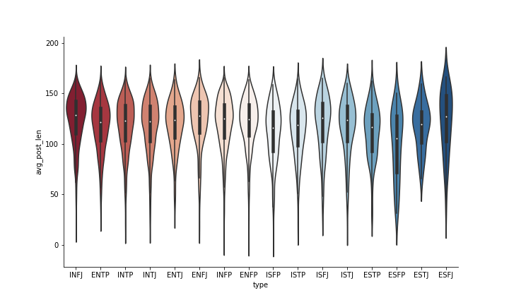
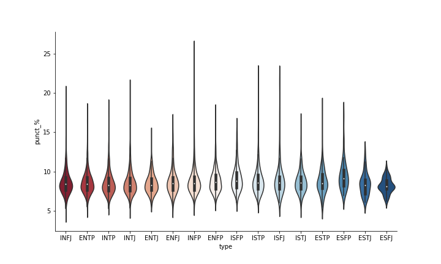
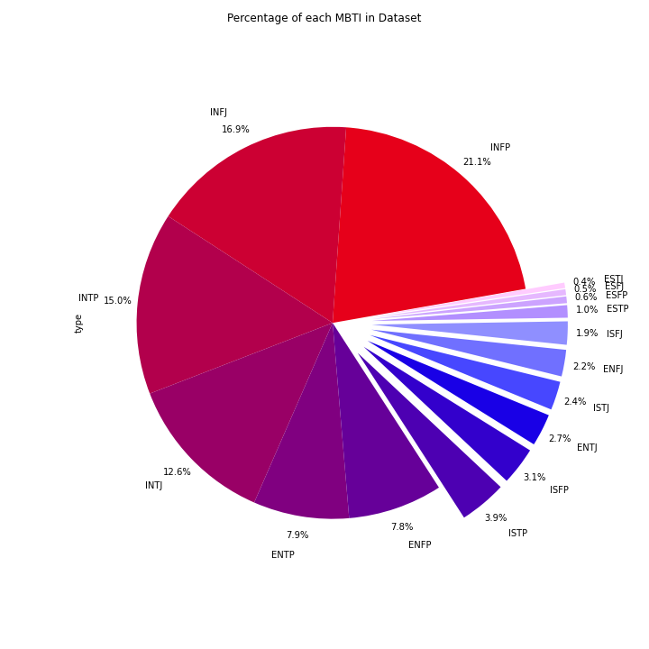

# Personality Prediction - Natural Language Processing with User Input

1. **Retrieving a dataset**

   We knew we wanted to explore something fun but meaningful. As we searched for ideas we came across the
 [(MBTI) Myers-Briggs Personality Type Dataset](https://www.kaggle.com/datasnaek/mbti-type/activity) and knew we found our next project!  

2. **Cleaning the Dataset**

    As we all know, our machines cannot train models on text without some simple tasks prior to the machine learning process. Below are some of the steps that were followed in our [pre-processing](https://github.com/andrewzee23/personality_prediction/blob/main/melissa/data_cleaning_1.ipynb) phase.

    * Removing HTML tags
    * Removing extra spaces
    * Removing special characters
    * Lowercase all text
    * Remove stopwords
    * Lemmatize
    * Tokenize

3. **Training the Dataset**
   
    We realized there were several different ways to tackle the [Machine Learning process](https://github.com/andrewzee23/personality_prediction/blob/main/kristina/machine_learning_final.ipynb). The model that finally worked for us returned around a 61% accuracy rate. We simplified the tasks associated with the text_cleaning, applied a CountVectoriezer, and used a Random Forest Classifier. 

4. **Flask**

    The model that produced the best result was 'pickled' and applied to [Flask](https://github.com/andrewzee23/personality_prediction/blob/main/andrew/app.py). In addition to the model, the tasks for cleaning the text was applied to Flask. 

5. **Web Application**

    The final result for the MBTI Machine Learning process was to request user input on the website. Once a user responded to the question presented, the Machine Learning model would produce a personality prediction based on the text entered. 

6. **Additional Artifacts**

    Durinng the 'exploration' of the dataset, some graphs were created and are displayed on the web application.

     * Violin Plot - Average Post Length
     

     * Violin Plot - Percent of Punctuation
     

     * Pie Chart - Percent of each MBTI Type represented in dataset
     
